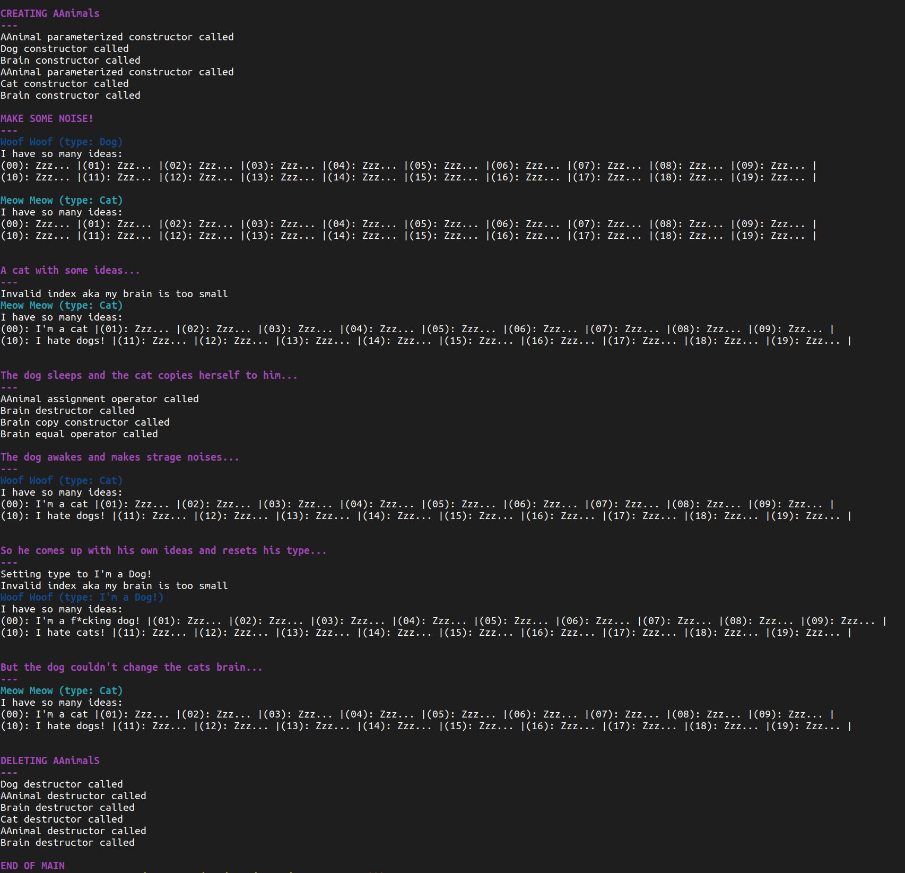

<!-- ahokcool HEADER START-->
---

   
  An overview of all my projects can be found here: <a href="https://github.com/ahokcool/ahokcool/blob/main/README.md" target="_blank">ahokcool</a>  
   
  This project was created as part of my studies at: <a href="https://www.42lisboa.com" target="_blank">42 Lisboa</a>  
   
  This project is part of a series of smaller C++ projects. An overview can be found here: <a href="https://github.com/ahokcool/CPPs/blob/main/README.md" target="_blank">CPPs</a> 

---
<!-- ahokcool HEADER END-->
<!-- PROJECT HEADER START -->
 

   
  <h1 align="center">CPP04</h1>
  Subtype polymorphism, abstract classes, and interfaces

 
<!-- PROJECT HEADER END -->

## :bulb: Lessons learned
- Deep dive into polymorphism and virtual functions.
- Working with abstract classes and pure virtual functions.
- Understanding interfaces and their implementation in C++.

<!-- ahokcool FOOTER-->
---

  <a href="#top">🔝 back to top 🔝</a>

